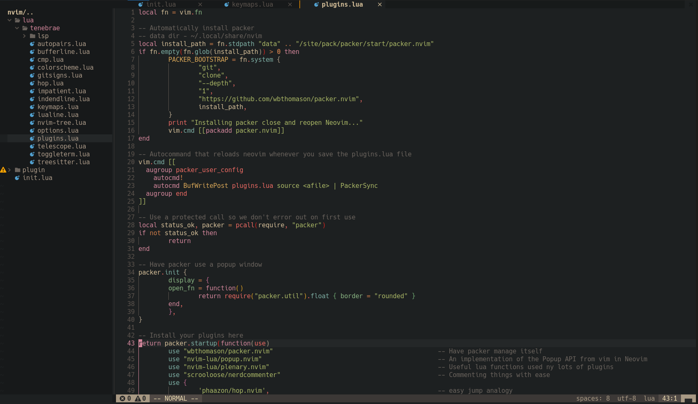

## Neovim config
```
-- =======================================
--        tenebrae's nvim config
--            _
--     __   _(_)_ __ ___  _ __ ___
--     \ \ / / | '_ ` _ \| '__/ __|
--  _   \ V /| | | | | | | | | (__
-- (_)   \_/ |_|_| |_| |_|_|  \___|
--
-- =======================================
```

Moved from classic vimrc to modern, lua-driven config.



https://github.com/LunarVim/Neovim-from-scratch
